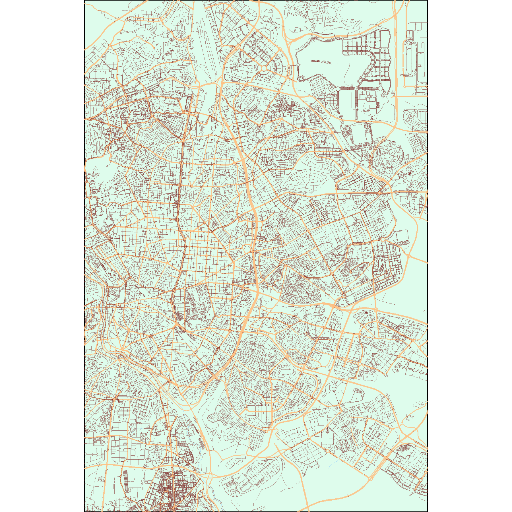

# PaintingCities
This script generates an image to paint artistic maps of cities. It is based on previous repos such as https://ggplot2tutor.com/streetmaps/streetmaps/ by Christian Burkhart or Accessing OpenStreetMap data with R by Dominic Royé https://dominicroye.github.io/en/2018/accessing-openstreetmap-data-with-r/

## Working with Open Street Maps
The script uses a conection to the Open Street Maps repository, leveraging the osmdata R package, and ggplot2 visualization libraries to paint city maps.

## Pre-requisites

- Install the latest version of R and Rstudio. 
- You will need to open the project with Rstudio, to ensure the appropriate behavoir of the here package

## What the script can do

- Paint city maps of a list of cities, specified in the array

```
ListOfCities <-c("Zaragoza", "Jerez de la Frontera")
```

- Modify the color palette of the map:
```
#selector colores
hxColorCallesGrandes <- "#000000"
hxColorCallesPequeñas <- "#000000"
hxColorRio <- "#000000"
hxColorMetro <- "#000000"
hxColorWater <- "#000000"
hxBackground <- "#fdfaf0" #ffffff
```
- **It takes a long time to generate a map** A small city can be plotted in less than a minute. But cities like Madrid or Rome can take up to 10 minutes depending on the power of your computer.

## Framing the map

- The script automatically loops through the **ListOfCities** vector and uses the Open Street Map repository to look for the city. 

- However, if you are not happy with the frame, you can provide the exact coordinates by using the bounding box, which can be easily retrieved from https://boundingbox.klokantech.com/ (I recommend using the CSV format), by setting the ``` blPrecision <- TRUE ``` **Note**: Please be aware that such feature will only work when the array ListOfCities contains a single city**

## Results

- All maps will be generated in the working directory in jpeg format. But it can be saved by modifying the following chunk
- The filename will inculde a timestamp so as not to override previous images

```
  strFileName <- paste(strShortName,
        Sys.time()%>%str_replace_all('[^0-9]', ''),
        ".jpeg",
        sep = "_")
  
  ggsave(strFileName, width = 6, height = 6)
```
### Map of Madrid


### Map of Zaragoza


### Map of Jerez de La Frontera


